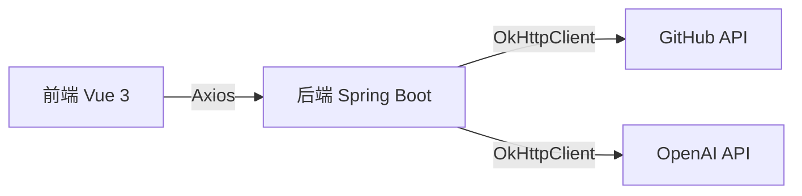

# Niuniu Judger 项目架构说明

## 项目简介

**Niuniu Judger** 是“求实创造队”在 2024 年七牛云 1024 创作节的参赛作品，旨在通过整合 GitHub 和 OpenAI 的 API，为用户提供开发者搜索、评估和项目管理等功能。

- 前端仓库：https://github.com/santonin1989/niuniu-judger-frontend
- 后端仓库：https://github.com/Cihnomi/NiuniuJudger

---

## 技术栈

### 前端

- **Vue 3**：渐进式 JavaScript 框架，用于构建用户界面。
- **TypeScript**：强类型的 JavaScript 超集，提高代码的可维护性和可读性。
- **Vite**：新一代前端构建工具，具有极速的冷启动和热更新能力。
- **Vue Router**：官方的路由管理器，用于 SPA（单页应用）的页面导航。
- **Axios**：基于 Promise 的 HTTP 客户端，用于与后端 API 进行通信。
- **Less**：CSS 预处理器，提供更丰富的样式编写方式。
- **ESLint**：代码静态分析工具，确保代码质量和风格一致性。

### 后端

- **Spring Boot**：基于 Spring 的快速开发框架，简化了 Spring 应用的创建、配置和部署。
- **Spring MVC**：实现了 MVC 模式的 Web 框架，用于处理 HTTP 请求和响应。
- **OkHttpClient**：高效的 HTTP 客户端，用于与 GitHub API 和 OpenAI API 进行通信。
- **OpenAI API**：提供自然语言处理和生成能力，用于分析和生成文本内容。
- **GitHub API**：用于获取 GitHub 上的开发者和项目数据。

---

## 整体架构

项目采用前后端分离的架构，前端使用 Vue 3 和 TypeScript 构建用户界面，后端使用 Spring Boot 提供 RESTful API 服务。前端通过 Axios 与后端进行通信，后端与 GitHub API 和 OpenAI API 交互，完成数据的获取和处理。



---

## 后端架构

### 分层架构

1. **表现层（Controller）**
   - **`DeveloperController`**：处理 HTTP 请求，定义与开发者相关的 RESTful 接口。
     - 依赖：
       - `DeveloperService`（业务逻辑层接口）
       - `GitHubApiUtil`（工具类，用于调用 GitHub API）

2. **业务逻辑层（Service）**
   - **`DeveloperServiceImpl`**：实现 `DeveloperService` 接口，包含开发者评估、项目获取等核心业务逻辑。
     - 依赖：
       - `GitHubApiUtil`（与 GitHub 交互获取数据）
       - `OpenAiUtil`（调用 OpenAI 服务进行自然语言处理）

3. **数据访问层（Util）**
   - **`GitHubApiUtil`**：封装对 GitHub API 的调用，提供获取开发者信息、项目数据等方法。
     - 依赖：
       - `OpenAiUtil`（在生成关键词和同义词时调用）

4. **辅助工具层（Util）**
   - **`OpenAiUtil`**：封装对 OpenAI API 的调用，提供自然语言处理功能。

### 主要接口和方法

#### 1. 开发者搜索与评估接口

##### （1）按名称搜索开发者

- **请求方式**：`GET /developers/searchByName`
- **处理流程**：
  1. `DeveloperController.searchDevelopersByName(String name)`
     - 调用 `developerService.searchDevelopersByName(String name)`
  2. `DeveloperServiceImpl.searchDevelopersByName(String name)`
     - 调用 `gitHubApiUtil.searchDevelopersByName(String name)`
  3. `GitHubApiUtil.searchDevelopersByName(String name)`
     - 使用 `OkHttpClient` 调用 GitHub API 搜索开发者
  4. 数据转换：
     - 使用 `BeanUtils.copyProperties` 将数据转换为 `DeveloperDTO`

##### （2）按关键词搜索开发者

- **请求方式**：`GET /developers/searchByKeyword`
- **处理流程**：
  1. `DeveloperController.searchDevelopersByKeyword(String keyword)`
     - 调用 `developerService.searchDevelopersByKeyword(String keyword)`
  2. `DeveloperServiceImpl.searchDevelopersByKeyword(String keyword)`
     - 调用 `gitHubApiUtil.searchDevelopersByKeywordAndSynonyms(String keyword)`
  3. `GitHubApiUtil.searchDevelopersByKeywordAndSynonyms(String keyword)`
     - 调用 `generateKeywordAndSynonyms(String keyword)` 生成同义词
     - 使用 `OkHttpClient` 调用 GitHub API 搜索开发者
  4. 对每个开发者进行评估：
     - 调用 `getDeveloperEvaluationv2(String username)`
  5. 数据转换和排序：
     - 使用 `BeanUtils.copyProperties` 将数据转换为 `DeveloperDTO`
     - 按 `TalentRank` 排序开发者列表

#### 2. 开发者评估接口

##### （1）获取开发者评估

- **请求方式**：`GET /developers/evaluate/{username}`
- **处理流程**：
  1. `DeveloperController.getDeveloperEvaluation(String username)`
     - 调用 `developerService.getDeveloperEvaluation(String username)`
  2. `DeveloperServiceImpl.getDeveloperEvaluation(String username)`
     - 获取开发者详情
     - 推断开发者的国家和领域
     - 生成开发者评估报告
     - 计算开发者的 `TalentRank`
  3. 数据转换：
     - 使用 `BeanUtils.copyProperties` 将数据转换为 `DeveloperDTO`

##### （2）生成开发者评估

- **请求方式**：`GET /developers/generateEvaluation`
- **处理流程**：
  - 与获取开发者评估的流程相似，但输入为 `Developer` 对象

#### 3. 项目相关接口

##### （1）获取开发者的项目列表

- **请求方式**：`GET /developers/{username}/projects`
- **处理流程**：
  1. `DeveloperController.getProjectsByDeveloper(String username)`
     - 创建 `Developer` 对象，设置 `username`
     - 调用 `developerService.getProjectsByDeveloper(Developer developer)`
  2. `DeveloperServiceImpl.getProjectsByDeveloper(Developer developer)`
     - 调用 `gitHubApiUtil.getProjectsByDeveloper(String username)`
     - 对每个项目计算项目重要性

##### （2）计算项目重要性

- **请求方式**：`GET /developers/projectImportance/{projectId}`
- **处理流程**：
  1. `DeveloperController.calculateProjectImportance(Long projectId)`
     - 创建 `Project` 对象，设置 `id`
     - 调用 `developerService.calculateProjectImportance(Project project)`
  2. `DeveloperServiceImpl.calculateProjectImportance(Project project)`
     - 根据项目的 `stars`、`forks`、`watchers` 计算项目重要性得分

### 依赖关系总结

- **表现层（Controller）**：处理 HTTP 请求，依赖于业务逻辑层和工具类。
- **业务逻辑层（Service）**：封装业务逻辑，依赖于数据访问层和辅助工具层。
- **数据访问层（GitHubApiUtil）**：封装对 GitHub API 的调用，提供数据支持。
- **辅助工具层（OpenAiUtil）**：封装对 OpenAI API 的调用，提供自然语言处理功能。

---

## 前端架构

### 项目结构

```
src/
├── api/                # API 请求封装
├── assets/             # 静态资源（图片、样式等）
├── components/         # 全局可复用组件
├── views/              # 页面级组件
├── router/             # 路由配置
├── utils/              # 工具函数
├── App.vue             # 根组件
├── main.ts             # 入口文件
```

### 路由配置

使用 **Vue Router** 进行路由管理，定义应用的导航结构，实现页面间的跳转和参数传递。

### 与后端通信

- **Axios 封装**：在 `api/` 目录下封装 Axios 请求，统一管理接口调用，便于维护和修改。
- **环境变量**：使用 `.env` 文件管理不同环境下的 API 根路径。

---

## 如何运行

### 前端

1. **环境要求**：Node.js **v18.20.3**
2. **安装依赖**：进入项目目录，运行：

   ```bash
   npm install
   ```

3. **配置环境变量**：修改 `.env.development` 文件，设置后端 API 的基础 URL：

   ```env
   VITE_NODE_ENV=development
   VITE_API_BASE_URL='http://<后端服务器IP>:<端口>'
   ```

4. **启动开发服务器**：

   ```bash
   npm run dev
   ```

### 后端

1. **环境要求**：JDK 1.8 及以上，Maven 3.6+
2. **安装依赖**：在项目根目录运行：

   ```bash
   mvn clean install
   ```

3. **配置文件**：根据需要修改 `application.properties` 或 `application.yml`，确保 API 密钥和端口配置正确。

4. **运行项目**：使用 IDE（如 IntelliJ IDEA）运行主类，或在命令行中执行：

   ```bash
   mvn spring-boot:run
   ```

---

## 如何构建

### 前端

1. **配置生产环境变量**：修改 `.env.production` 文件，设置生产环境下的后端 API 基础 URL。

2. **构建项目**：

   ```bash
   npm run build
   ```

3. **部署**：将生成的 `dist` 目录部署到静态服务器（如 Nginx）。

### 后端

1. **构建项目**：

   ```bash
   mvn clean package
   ```

2. **部署**：将生成的 JAR 文件部署到服务器，运行：

   ```bash
   java -jar target/<your-application>.jar
   ```

---

## 注意事项

- **API 密钥安全**：妥善保管 GitHub 和 OpenAI 的 API 密钥，避免在公共仓库中泄露。
- **版本控制**：建议使用 Git 进行版本管理，定期提交和推送代码。
- **代码规范**：前端使用 ESLint，后端遵循 Java 的编码规范，保持代码风格一致。
- **依赖更新**：定期检查并更新依赖库，注意兼容性问题。

---

## 结语

以上是 **Niuniu Judger** 项目的完整架构说明，涵盖了前后端的技术选型、架构设计和运行指南。希望对开发者理解和参与项目有所帮助。